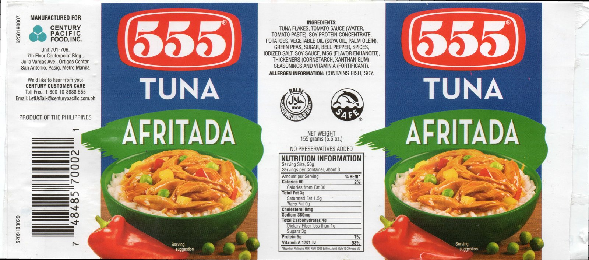
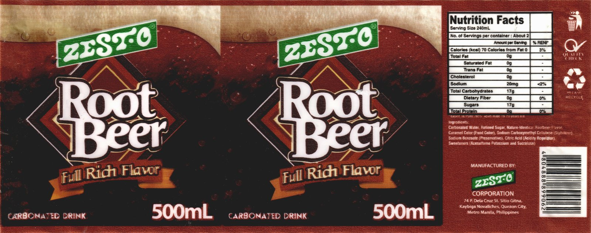

# Awesome Retail Vision

A curated list of **research ideas, papers, datasets and tools for retail vision and embodied retail AI** — building photorealistic virtual retail worlds (SKU-level 3D, shelves, full stores) and training spatial foundation models inside them.

Part of the **Ubiquitous Retail Group (UCL) × UP Diliman Ubiquitous Computing Lab** collaboration, extending [Sari Sandbox](https://github.com/upeee/sari-sandbox-env). Supervised by [Dr. Rowel Atienza](https://github.com/roatienza).

**Start here:** 📋 [Research Tracks](RESEARCH_TRACKS.md) — the open problems we want to work on, from SKU digitization to spatial foundation models. Propose ideas via `IDEA:` issues ([CONTRIBUTING](CONTRIBUTING.md)).

---

## 🎯 The Big Picture

**Overarching goal:** create a Just-Walk-Out-like virtual retail environment — near-1:1 3D SKUs, generated shelves and scenes, human clones — produce *many* such worlds, and train **spatial foundation models** on them. Amazon focuses on retail world models; we focus on spatial foundation models.

**Why SKUs first:** if we can generate near-1:1 3D product objects, half the work is done — shelves and scenes are comparatively easy. The hard parts, in order: SKU digitization → scene generation → human clones.

**Target venue:** ICCV 2027 (main paper deadline expected March 7, 2027).

---

## 📑 Contents

- [Core Research Threads](#-core-research-threads)
  - [Virtual Try-On / Try-Off for Retail](#virtual-try-on--try-off-for-retail)
  - [3D Generation & 3D Gaussian Splatting](#3d-generation--3d-gaussian-splatting)
  - [Texture Generation & Super-Resolution](#texture-generation--super-resolution)
  - [Scene, Store & World Generation](#scene-store--world-generation)
  - [Spatial Foundation Models](#spatial-foundation-models)
  - [Embodied Retail Agents & Benchmarks](#embodied-retail-agents--benchmarks)
  - [Human Clones & Digital Humans](#human-clones--digital-humans)
- [Datasets & Assets](#-datasets--assets)
- [Tools & Pipelines](#-tools--pipelines)
- [Related Surveys](#-related-surveys)
- [Open Problems](#-open-problems)

---

## 🔥 Core Research Threads

### Virtual Try-On / Try-Off for Retail

The inspiration for our texture→3D / 3D→texture SKU tasks: bidirectional garment transfer, applied to retail packaging.

- [Voost: A Unified and Scalable Diffusion Transformer for Bidirectional Virtual Try-On and Try-Off](https://arxiv.org/abs/2508.04825) — jointly learns try-on and try-off with a single DiT; SOTA on both. *Why retail:* try-off is the more learnable direction — the same asymmetry should hold for SKU texture↔3D transfer; bidirectional consistency is the trick worth stealing. [Project page](https://nxnai.github.io/Voost/) (SIGGRAPH Asia 2025). `texture` `sku-3d`

### 3D Generation & 3D Gaussian Splatting

Image/text → 3D assets, and the 3DGS representation our texture work builds on.

- [TRELLIS: Structured 3D Latents for Scalable and Versatile 3D Generation](https://arxiv.org/abs/2412.01506) — unified structured-latent 3D generation decodable to 3D Gaussians or meshes; image-to-3D SOTA. *Why retail:* our candidate SKU 3D generator — image-to-3D from product photos, with local editing for label fixes. [Code](https://github.com/microsoft/TRELLIS) (CVPR 2025 Spotlight). `sku-3d` `3dgs`
- [Hunyuan3D 2.5: Towards High-Fidelity 3D Assets Generation with Ultimate Details](https://arxiv.org/abs/2506.16504) — 10B shape model (LATTICE) + PBR texture painting. *Why retail:* strongest open high-fidelity image-to-3D baseline; PBR output matters for shelf lighting realism. [Code](https://github.com/Tencent-Hunyuan/Hunyuan3D-2) (Tencent, 2025). `sku-3d` `texture`
- [Heat Kernel Textures: the Geodesic Gaussians That Do Not Splat](https://arxiv.org/abs/2609.07557) — UV-free texture representation: anisotropic heat kernels on the mesh surface, no UV unwrapping, no seams. *Why retail:* our candidate texture representation for SKU re-texturing — kills UV seams/distortion on boxy packaging; integrates with PBR rendering. [Project page](https://www.simofoti.com/publications) (ECCV 2026 Oral). `3dgs` `texture`

### Texture Generation & Super-Resolution

Getting texture-grade product imagery without buying and scanning every SKU.

- [GarmentZoom: Generating Zoomable Images from Garment Listings](https://arxiv.org/abs/2606.29535) — reference-based super-resolution: full-view photo + unaligned close-up → zoomable 3–20× detail. *Why retail:* exactly our texture-acquisition problem — lift average-quality scraped product photos to texture-grade close-ups using cheap reference material. [Project page](https://jason-31.github.io/garmentzoom/) (UW, 2026). `texture` `sku-3d`

### Scene, Store & World Generation

From single SKUs to whole stores and interactive worlds.

- [Genie 3: A new frontier for world models](https://deepmind.google/blog/genie-3-a-new-frontier-for-world-models/) — text → real-time navigable interactive worlds (24 fps, 720p, minutes of consistency). *Why retail:* the ceiling for what generated worlds can do; our worlds are asset-based and controllable where Genie is prompt-based and not. (DeepMind, Aug 2025). `world-model` `scene-gen`
- [Marble: A Multimodal World Model](https://www.worldlabs.ai/blog/marble-world-model) — text/image/video/3D-layout → persistent 3D worlds, exportable as Gaussian splats or meshes. *Why retail:* the splat/mesh export path is the bridge from prompt-generated worlds to our asset-based pipeline. [Marble Labs](https://www.worldlabs.ai/blog/marble-world-model) (World Labs, Nov 2025). `world-model` `3dgs`

### Spatial Foundation Models

The end goal: models with grounded 3D spatial reasoning, pretrained in our generated retail worlds.

- [SpatialRGPT: Grounded Spatial Reasoning in Vision-Language Models](https://arxiv.org/abs/2406.01584) — region-level 3D spatial reasoning via 3D-scene-graph data curation + depth plugin; SpatialRGBT-Bench. *Why retail:* the architecture and benchmark template for our spatial FM — region-aware reasoning is exactly what shelf auditing needs. [Code](https://github.com/AnjieCheng/SpatialRGPT) (NeurIPS 2024). `spatial-fm` `embodied`

### Embodied Retail Agents & Benchmarks

Simulators, agents and benchmarks in the retail domain — our home turf.

- [Sari Sandbox: A Virtual Retail Store Environment for Embodied AI Agents](https://arxiv.org/abs/2508.00400) — photorealistic 3D retail sim, 250+ interactive grocery items, VR + VLM agent, SariBench human demos. *Why retail:* the base we extend; its real-scanned SKU textures are the quality bar for generated ones. [Code](https://github.com/upeee/sari-sandbox-env) (ICCV 2025 Workshop). `embodied` `dataset`
- [Sari Sandbox 2: An Embodied AI Agent Platform for Virtual Retail Environments](#) — LiDAR+SLAM scene-graph world model, store builder, multiplayer, 1.8× faster; agent hits 100/91/37% on easy/average/difficult tiers. *Why retail:* the platform this group builds on. (Villa, Baclor & Atienza, UP Diliman, 2026 — preprint). `embodied` `tooling`
- [RoboBenchMart: Benchmarking Robots in Retail Environment](https://arxiv.org/abs/2511.10276) — dark-store manipulation benchmark: procedural layout generator, trajectory pipeline, baselines. *Why retail:* closest robotic-retail benchmark; its 3D SKUs lack real barcode/nutrition-fact textures — the gap our SKU pipeline targets. [Code](https://github.com/emb-ai/RoboBenchMart) (FusionBrain, 2025). `embodied` `scene-gen`
- [WRS Future Convenience Store Challenge (FCSC)](https://f-csc.org/en/wrs-fcsc-2025/) — annual robot competition: restocking and disposal in a simulated convenience store. *Why retail:* the task taxonomy (stocking, FIFO disposal, shelf arrangement) maps directly onto our agent task suite. (WRS, 2024–2025). `embodied`

### Human Clones & Digital Humans

Controllable shoppers and staff inside generated stores. *(Track C — least explored, highest risk; help wanted.)*

- *(nothing listed yet — see [RESEARCH_TRACKS.md → Track C](RESEARCH_TRACKS.md))* — identity-preserving avatars, try-on on articulated 3D bodies, plausible shopping behavior generation. `human-avatar`

---

## 🗃 Datasets & Assets

- **Sample SKU label textures** — [`images/555_TUNA_AFRITADA_155G.jpg`](images/555_TUNA_AFRITADA_155G.jpg) (8192×3618, 7.0 MB) and [`images/ZESTO_ROOT_BEER_500ML_LABEL.jpg`](images/ZESTO_ROOT_BEER_500ML_LABEL.jpg) (4000×1579, 2.1 MB): wrap-around label scans of a canned tuna and a bottled root beer, the concrete target format for Track A — flat label art to be wrapped onto can/bottle geometry, with barcode and nutrition facts intact.

| 555 Tuna Afritada 155g | Zesto Root Beer 500ml |
|---|---|
|  |  |

- [RoboBenchMart Assets](https://huggingface.co/datasets/emb-ai/RoboBenchMart_assets) — 2.4 GB of retail environment assets (shelves, fake shelves, downscaled props) for ManiSkill. *Why retail:* reusable shelf/prop geometry; pair with our SKU textures. `dataset`
- Sari Sandbox product scans — 250+ real-scanned SKU textures (from the original Sari Sandbox release; see [repo](https://github.com/upeee/sari-sandbox-env)). *Why retail:* scanner-grade ground truth for evaluating generated textures. `dataset` `sku-3d`

## 🛠 Tools & Pipelines

- [Sari Sandbox Store Builder](https://github.com/upeee/sari-sandbox-env) — in-sandbox store construction (Sari Sandbox 2). *Why retail:* our starting point for procedural planogram generation. `tooling` `scene-gen`
- [ManiSkill](https://github.com/haosulab/ManiSkill) — the simulation backend RoboBenchMart builds on (Vulkan-based, GPU-parallel). *Why retail:* candidate backend if we benchmark manipulation in our stores. `tooling` `embodied`

## 📚 Related Surveys

- [Spatial intelligence in vision-language models: a comprehensive survey](https://link.springer.com/article/10.1007/s10462-026-11671-x) — unified survey of spatially-enhanced VLMs; empirical study across 37 models, 9 benchmarks. *Why retail:* the map of Track D's landscape. (Artificial Intelligence Review, Aug 2026). `spatial-fm`

## ❓ Open Problems

The live list lives in [RESEARCH_TRACKS.md](RESEARCH_TRACKS.md). Headline questions:

1. **Texture acquisition at scale** — can reference-based super-resolution (GarmentZoom-style) replace buying-and-scanning every SKU?
2. **Texture→3D for packaging** — enforcing box/can/bottle priors so generated SKUs are shelf-ready, with legible barcodes and nutrition facts.
3. **3D→texture (re-texturing)** — UV-free representations (HKTex) vs UV atlases on boxy packaging; consistency across carton faces.
4. **Evaluating 1:1-ness** — barcode decodability, OCR of nutrition panels, texture fidelity vs scanner ground truth.
5. **Synthetic-to-real transfer** — how much does spatial-FM pretraining in generated stores transfer to real store footage?
6. **Human clones** — identity-preserving avatars with garment handling and plausible shopping behavior, at data-generation scale.

---

## License

MIT © [Rowel Atienza](https://github.com/roatienza) — see [LICENSE](LICENSE).